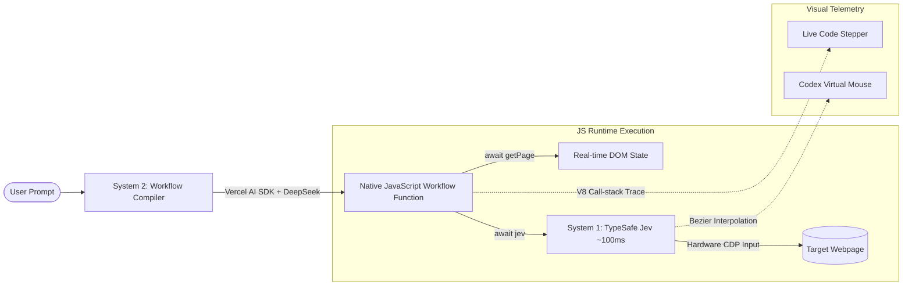

<div align="center">

# ⚡ run-workflow

**Code-driven AI browser automation for Chrome.**  
*Compiles natural language into native JavaScript workflows with sub-100ms visual actions, real-time code stepper & Codex-style virtual mouse.*

[](https://opensource.org/licenses/MIT)
[](https://www.typescriptlang.org/)
[](https://developer.chrome.com/docs/extensions/mv3/intro/)
[](https://sdk.vercel.ai/)
[](https://ollama.ai)

</div>

---

## 🌟 Why `run-workflow`?

Most AI browser agents (e.g. traditional multi-modal agents) suffer from three critical bottlenecks:
1. **Slow execution latency**: Every single click requires re-encoding a screenshot and waiting 3-6 seconds for a giant vision model.
2. **Brittle orchestration**: Workflows are forced into rigid JSON schemas or prompt loops with zero real control flow.
3. **Heavy environment requirements**: They demand Python backends, Docker containers, or VNC virtual desktops.

**`run-workflow` takes a radically different approach:**
- **Zero-Docker, Pure Chrome Extension**: Runs directly inside your browser via Chrome Manifest V3 and Chrome DevTools Protocol (CDP).
- **Dual-System Cognition (S1 + S2)**: System 2 writes a clean, native JavaScript dynamic workflow function; System 1 (TypeSafe AI Jev) executes sub-100ms visual micro-actions.
- **Visual Voice-and-Motion Sync**: Watch the **Live Code Stepper** highlight the active JavaScript line in real time, while the **Codex Virtual Mouse** glides along Bezier curves on the page with click ripples.

---

## 🚀 Key Features



### 1. 📜 Executable JS Dynamic Workflows (Claude Code & Pi Compatible)
Workflows are compiled into pure JavaScript async functions (`async function run(ctx)`):
- Variables are preserved natively in JS runtime memory.
- Real-time condition checking (`while (true) { const page = await getPage(); if (!hasPending) break; }`) eliminates rigid static counters.
- Built-in primitives:
  - `await ctx.jev(subgoal)`: Sub-100ms visual target selection & hardware click.
  - `await ctx.getPage()`: Real-time viewport DOM, modal status & elements.
  - `ctx.phase(title)`: Live UI timeline declaration.
  - `await ctx.wait(ms)`: DOM settling wait.
  - `await ctx.scroll(deltaY)`: Smooth wheel scrolling.
  - `ctx.log(message)`: Structured trace logging.

### 2. 💻 Live Workflow Code Stepper (Real-time Line Highlighting)
- Uses zero-overhead **V8 Call-stack Caller Tracing** (`new Error().stack` + SourceURL) to track execution with sub-millisecond precision.
- The Sidepanel displays the workflow code in a dark terminal viewer with line numbers.
- As each line executes, that line glows with a soft purple highlight and automatically smooth-scrolls into the center of the viewport!

### 3. 🖱️ Codex-Style Virtual Mouse Cursor
- Injected via **Shadow DOM** exclusively in the top frame, completely immune to host page CSS conflicts.
- High-precision SVG pointer with glowing "Ang" indicator.
- Synchronized with background CDP hardware movement, rendering authentic **Cubic Bezier trajectories** and dynamic **circular click ripples**.
- Strictly non-intrusive (`pointer-events: none !important`).

### 4. 🛡️ Hardware-Level Anti-Bot Human Emulation
- Direct Chrome DevTools Protocol (`Input.dispatchMouseEvent`, `Input.dispatchKeyEvent`) ensures `event.isTrusted === true`.
- Three-dimensional Bezier curves with Fitts's law acceleration and physiological micro-jitter.
- Gaussian Poisson-distributed keystroke delays.

### 5. 🎯 Configurable URL Matching & Recipe Manager
- Full-featured Workflow Manager in the Options page.
- 4 flexible URL matching syntaxes:
  - **Global (`*` or empty)**: Matches every page.
  - **Domain / Path Substring**: e.g. `admin.example.com` or `github.com/pulls`.
  - **Wildcard Glob**: e.g. `*.example.com/*` or `https://*`.
  - **Regular Expressions**: e.g. `/^https:\/\/.*\.example\.com/i`.
- Real-time URL matching rule simulator & code editor with syntax verification.

---

## 🛠️ Quick Start

### 1. Clone & Install Dependencies
```bash
git clone https://github.com/ycwfmelt/run-workflow.git
cd run-workflow
pnpm install
```

### 2. Build the Extension
```bash
pnpm run build
```
The output will be generated in the `dist/` directory.

### 3. Load into Google Chrome
1. Open Chrome and navigate to `chrome://extensions/`.
2. Enable **Developer mode** in the top right corner.
3. Click **Load unpacked** and select the `dist/` directory inside this repository.
4. Pin the **RunWorkflow** extension icon to your toolbar.

### 4. Configure Credentials
1. Click the extension icon to open the Sidepanel, then click the **⚙️ (Settings)** icon.
2. Enter your **TypeSafe API Key** (for System One ~100ms micro-actions).
3. System Two is pre-configured to connect to local **Ollama** (`http://localhost:11434/v1`) using `deepseek-v4.1-flash:cloud`.
   *(If Ollama is not running, the system automatically degrades to the universal intelligent workflow engine without crashing.)*

---

## 📁 Repository Structure

```text
run-workflow/
├── manifest.json            # Chrome Extension Manifest V3 configuration
├── vite.config.ts           # Multi-entry bundling config
├── public/icons/            # Vector & raster icons (icon.svg, PNGs)
├── src/
│   ├── background/
│   │   ├── index.ts         # Service Worker & messaging dispatcher
│   │   ├── agent-loop.ts    # Central task execution coordinator & V8 line tracer
│   │   ├── offscreen-runner.ts # Offscreen document manager & sandbox bridge
│   │   ├── cdp-client.ts    # Hardware input layer (CDP mouse/keyboard dispatch)
│   │   ├── bezier-mouse.ts  # Human trajectory & physical anti-bot model
│   │   └── typesafe-service.ts # TypeSafe Jev API client
│   ├── offscreen/           # MV3 offscreen host embedding isolated sandbox
│   ├── sandbox/             # Relaxed CSP sandbox for dynamic JS execution & tracing
│   ├── workflows/           # Dynamic Workflow Engine
│   │   ├── types.ts         # WorkflowContext primitives & definitions
│   │   ├── compiler.ts      # Vercel AI SDK + DeepSeek workflow compiler
│   │   └── workflow-registry.ts # Storage registry & 4-mode URL match engine
│   ├── content/
│   │   ├── index.ts         # Content script message receiver
│   │   ├── virtual-cursor.ts # Shadow-DOM Codex virtual mouse & click ripple
│   │   └── dom-extractor.ts # High-efficiency DOM extraction & deduplication
│   ├── sidepanel/
│   │   ├── index.html       # Sidepanel UI (Live Code Stepper, Telemetry, Trace)
│   │   └── main.ts          # Sidepanel reactive controller
│   └── options/
│       ├── index.html       # Workflow Manager & Global settings UI
│       └── options.ts       # Recipe editor, CRUD & URL match simulator
└── dist/                    # Production build artifacts (ready to load in Chrome)
```

---

## 🤝 Contributing

Contributions, issues, and feature requests are welcome!
Feel free to check the [issues page](https://github.com/ycwfmelt/run-workflow/issues).

---

## 📄 License

This project is licensed under the [MIT License](LICENSE).
